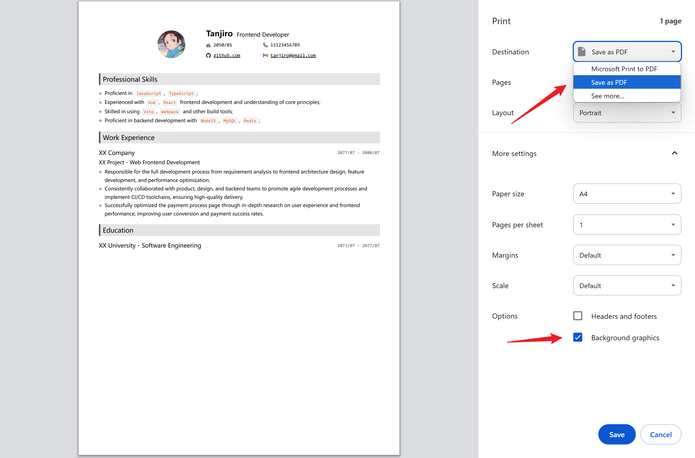

  <h2>Build Your Resume Online</h2>
  
dnd-resume is a free and open-source resume builder that helps you create professional resumes with ease.

  

  <h2>Preview</h2>
  
Get a real-time preview of your resume as you build it.

  

  <h2>Export to PDF</h2>
  
Seamlessly export your resume to PDF format using the browser's built-in print functionality.

  
  
For Windows 11 Chrome users: Select "Save as PDF" as the destination when printing.

  

  <h2>Project Growth</h2>
  

